# 1.4

We found our sum\_squared to be

$$
    \text{sum_squared} = \begin{bmatrix}
        983.7296 \\
        600.8452
    \end{bmatrix}
$$

While these may seem large, considering our data points are in the order of $10^3$, this is a very low error being more in line with an order of $10^{-3}$.

# 2

Using the images of the checkerboard, we found

$$
    K_{checker}=\begin{bmatrix}
        2.8345 & 0 & 1.5047 \\
        0 & 2.8358 & 1.9654 \\
        0 & 0 & 1
    \end{bmatrix} \times 10^3.
$$

Additionally, we estimated that

$$
    K=\begin{bmatrix}
        2.6495 & -1.0324 & -3.8967 \\  
        0 & 1.1764 & 3.2343 \\
        0 & 0 & 1
    \end{bmatrix} \times 10^3.
$$

We figured the error in our estimated $K$ came from both the fact that K is an estimate from only 6 points. Additionally, since we choose the points on both images, there may be some human error in the exact locations of points we chose on both the image and the object.

# 3

$K$:
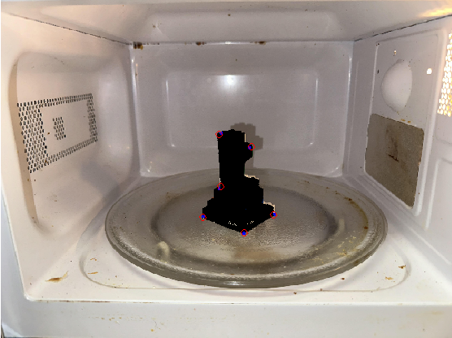 \\
The operations used include: 
None. First mesh for k

$K_{checker}$:
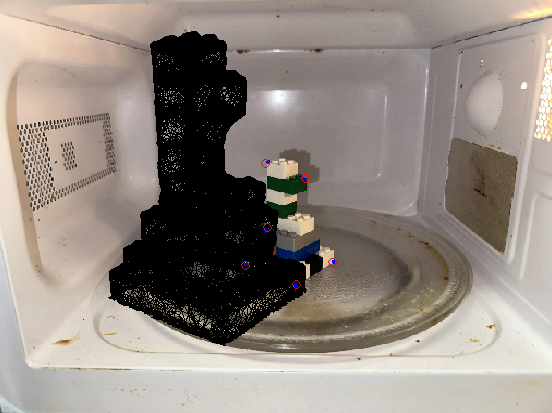 \\
The operations used include: 
None. First mesh for k_checker

## Surface 1

### Image 1

$K$:
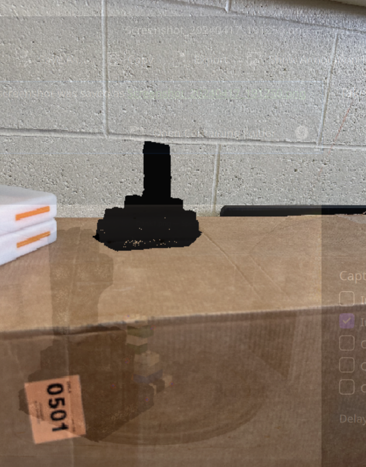 \\
The operations used include: 
Rotated in the y axis 60 degrees, and in the z axis -20 degrees. Then translated a bit to sit towards the back edge of the box.

$K_{checker}$:
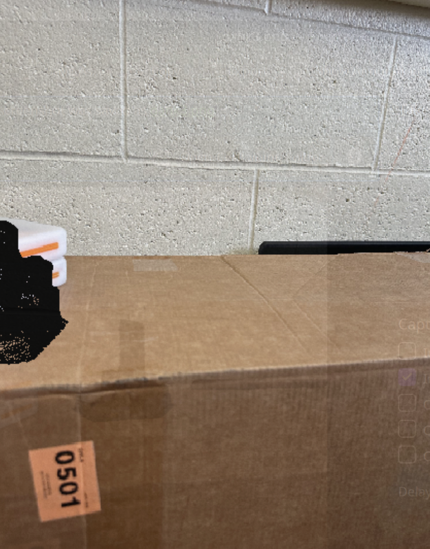 \\
(Uses same operations as above)

### Image 2

$K$:
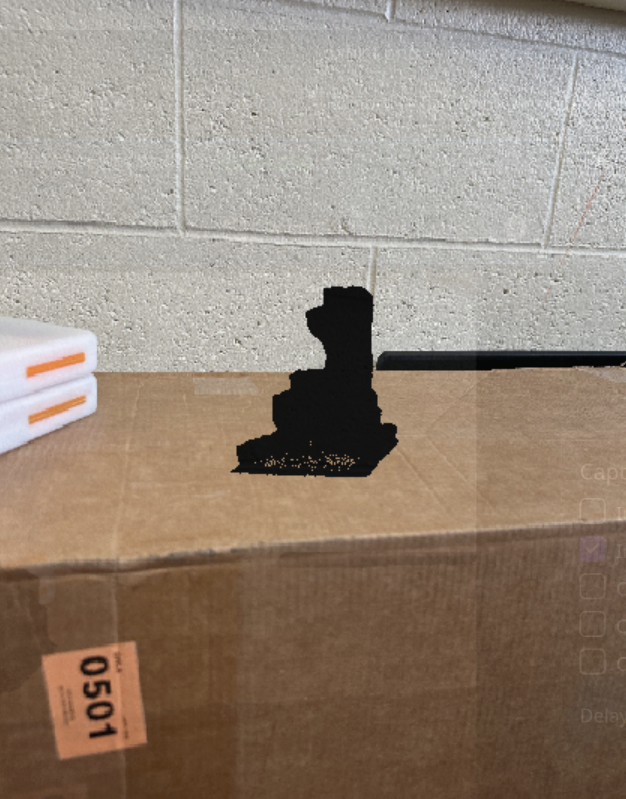 \\
The operations used include:
Rotated 5 degrees in the y direction. Then, translated to be in the center of the box.

$K_{checker}$:
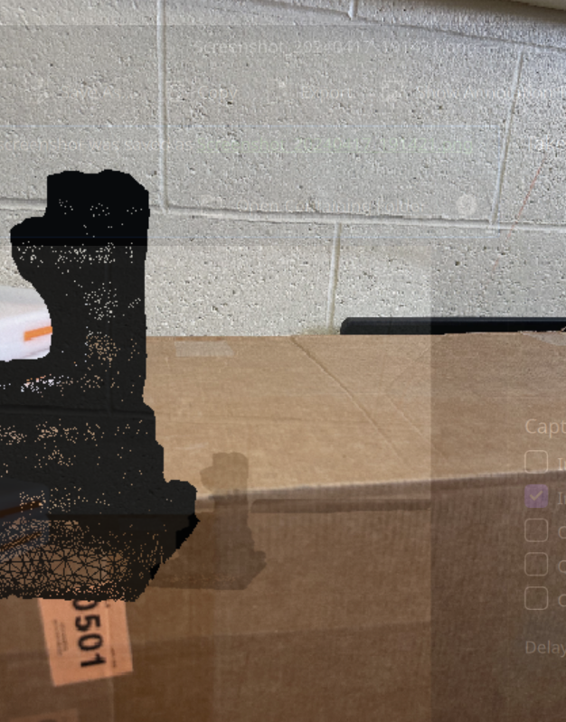 \\
(Uses same operations as above)

### Image 3

$K$:
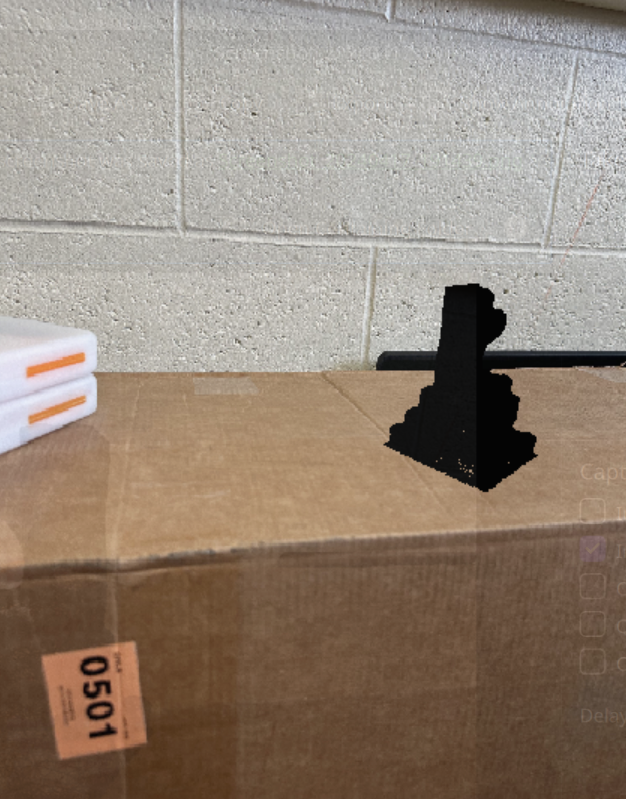 \\
The operations used include:
Rotated in the y axis by 140 degrees and a bit in the z axis to look more realistic. Translated to be on the right side of the box.

$K_{checker}$:
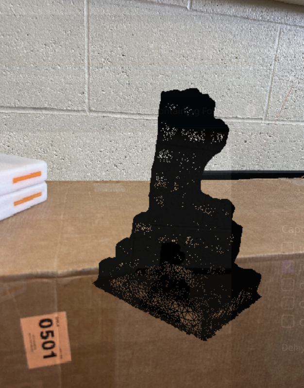 \\
(Uses same operations as above)

## Surface 2

### Image 1

$K$:
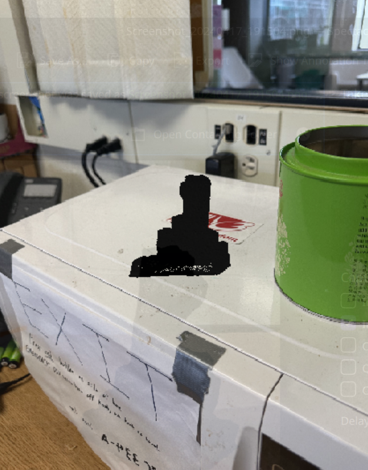 \\
The operations used include:
Rotated in the y axis -90 degrees and 10 degrees in the z axis to be on the microwave. Translated then to appear towards the edge of the microwave.

$K_{checker}$:
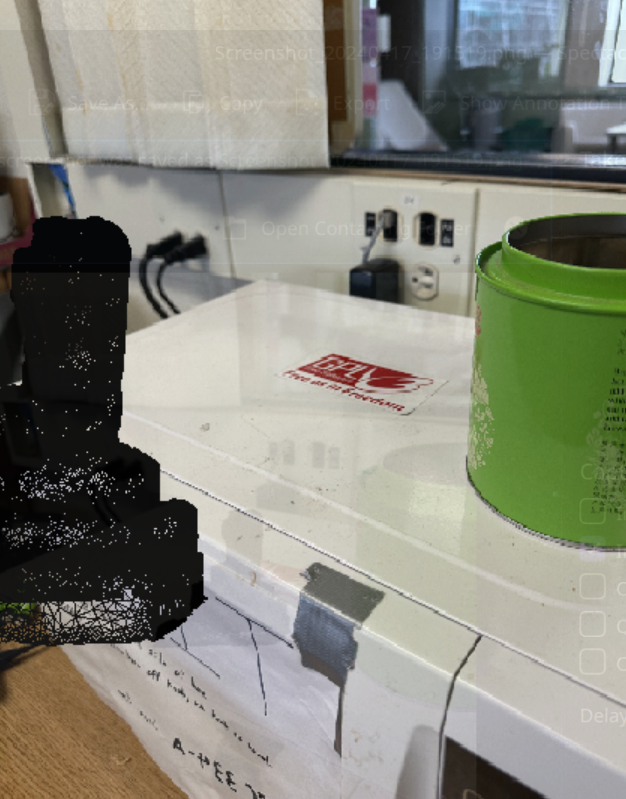 \\
(Uses same operations as above)

### Image 2

$K$:
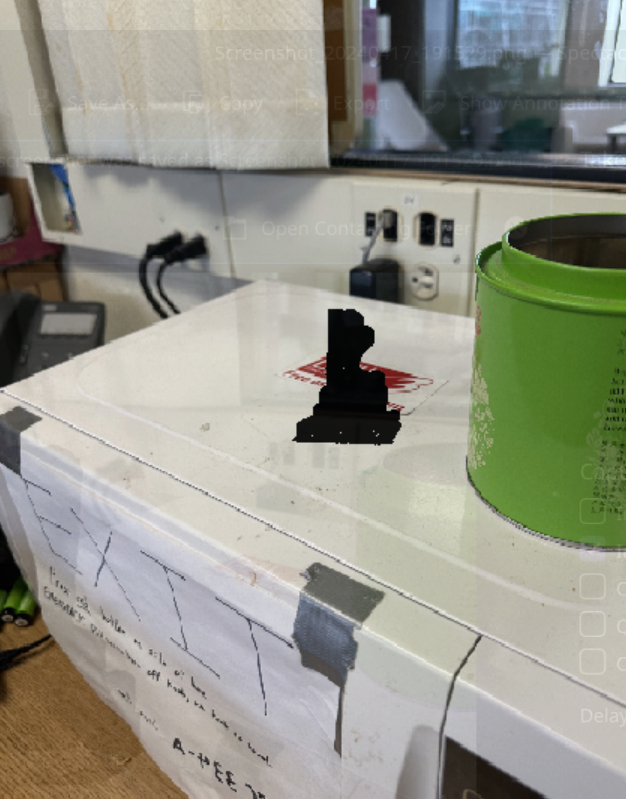 \\
The operations used include:
Rotated -180 degrees in the y axis and in the z axis -3 degrees to look more realistic. Then, translated to be towards the center of the microwave.

$K_{checker}$:
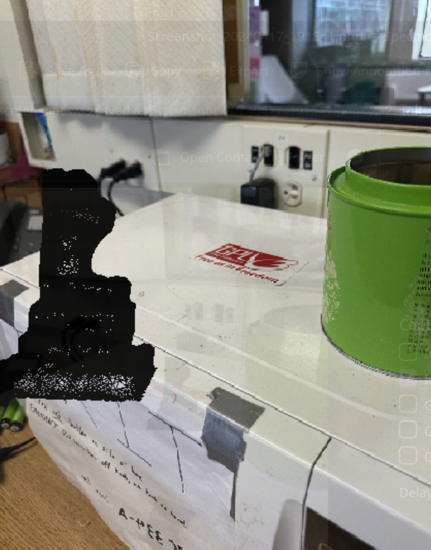 \\
(Uses same operations as above)

### Image 3

$K$:
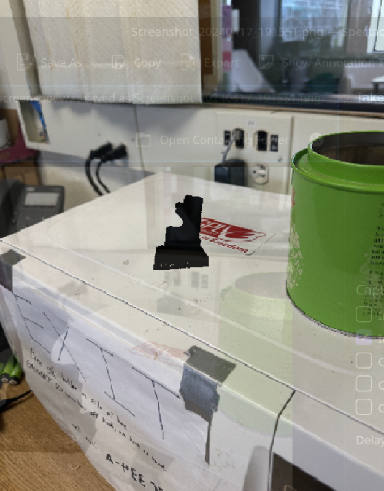 \\
The operations used include:
Rotated in all directions to sit on top of the microwave almost normally. Then, translated to appear still on the microwave.

$K_{checker}$:
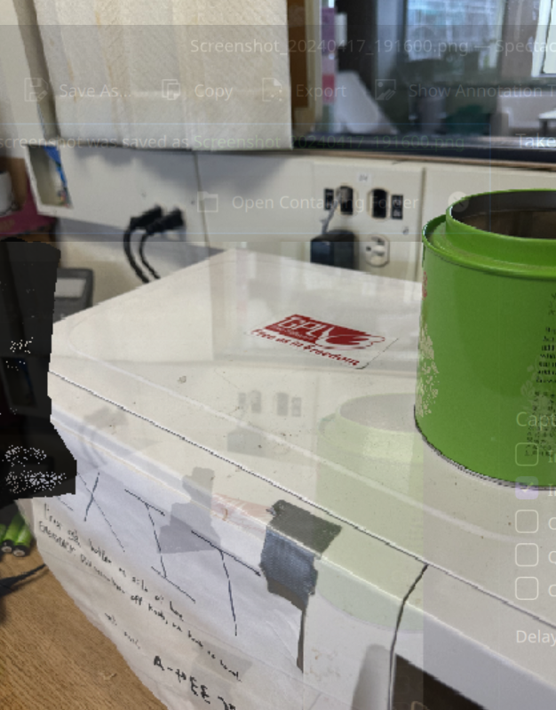 \\
(Uses same operations as above)

$K$ has worse quality than $K_{checker}$. This may be due the estimates for $K$ are less accurate as they are more likely to face human error.
